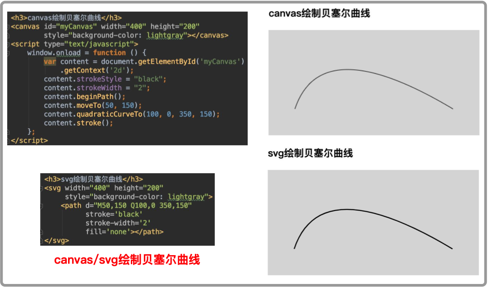

# SVG技术在WebGIS上的应用--标绘
### 1、技术背景
&emsp;WebGIS技术不断成熟，也涌现出了众多的前端js框架，比如OpenLayer,AGS API for JS,Mapbox GL JS,Cesium等，这些前端框架为开发者和用户提供了良好的开发体验和使用体验，但在标绘功能上一直没有提供丰富的接口供开发者使用。 
&emsp;比如在军事标绘领域，经常需要标绘复杂的军标，这些军标的绘制都是需要复杂的算法进行计算[附录1]，而绘制中常用单元就是贝塞尔曲线，在openlayer,mapbox框架中并没有提供这样的基本接口，虽然ol的第三方插件可以提供复杂图标的标绘功能[附录2]，但其本质是采用插值的方式拟合出曲线，绘制完成后，记录的是地图上的一系列点坐标，这样得到的标绘地图是没法进行编辑和修改的。至于其他框架，有些提供绘制贝塞尔曲线的接口，但超出本人技术栈，未作深入研究。 
&emsp;对于常用的WebGIS前端框架，没有提供曲线绘制接口，不过庆幸的是html的两个元素提供了：canvas，svg；
### 2、canvas VS SVG
&emsp;canvas和SVG技术都可以绘制曲线，代码效果如下

&emsp;虽然两者都可以绘制，但canvas需要使用js，而且绘制逻辑主要体现在js代码中，对于标绘图的文档化十分不便。而SVG的绘图所使用的端点和控制点都在html标签的属性中，只需要修改属性值，便可对标绘图进行修改。

### 3、开发计划
&emsp;本文主要采用SVG技术，开发基于WebGIS上的标绘功能，由于各种复杂的军事标绘图都需要复杂算法，这里仅以"双箭头"为例说明复杂军标的标绘功能。 
<table>
  <tr>
    <th>阶段</th>
    <th>功能描述</th>
    <th>完成情况</th>
    <th>完成时间</th>
  </tr>
  <tr>
    <td rowspan="3">简单标绘功能</td>
    <td>实现线，圆，多边形，折线功能标绘</td>
    <td>已完成</td>
    <td>2019-09-08</td>
  </tr>
  <tr>
    <td>实现标绘图的拖拽，编辑功能</td>
    <td>未实现</td>
  </tr>
  <tr>
    <td>实现标绘图的导入，导出和存储</td>
    <td>未实现</td>
  </tr>
  <tr>
    <td>复杂标绘功能</td>
    <td>c2</td>
    <td>c3</td>
  </tr>
  <tr>
    <td>和地图联动功能</td>
    <td>c2</td>
    <td>c3</td>
  </tr>
  <tr>
    <td>协同标绘</td>
    <td>c2</td>
    <td>c3</td>
  </tr>
</table>

### 附录1、参考文献
[1] 李剑萍, 章玲玲, 李昊, 等. 基于Flex与ArcGIS Server的Web军事态势标绘系统设计与实现[J]. 测绘地理信息, 2014, 39(3): 59-61.  
[2] https://gitee.com/ilocation/plot 
[3] J. David Eisenberg /Amelia Bellamy-Royds.SVG精髓